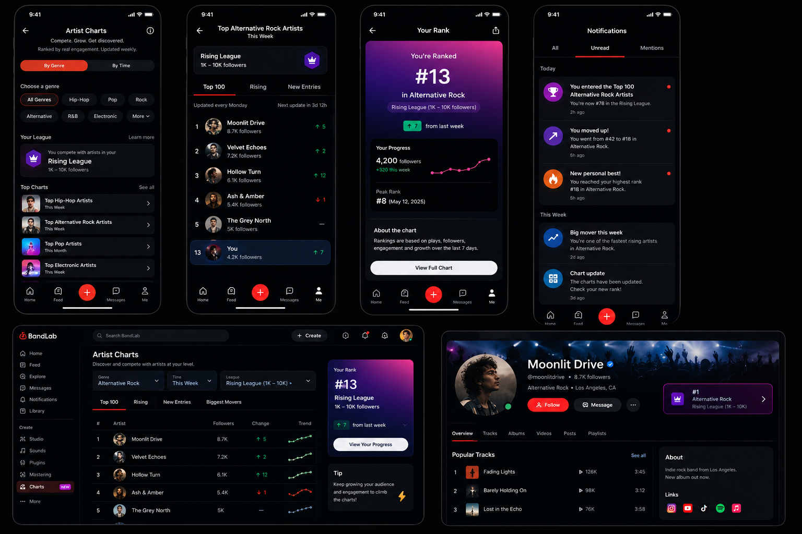

# Artist Charts

## Can this be a standalone feature?

🟢 Yes.

## UI and reference

Inspired by this [BandLab feature wishlist](https://www.reddit.com/r/Bandlab/comments/1qo2i10/my_bandlab_2026_feature_wishlist_an_indepth_guide/).

## The idea

Artist Charts rank popular and fast-growing artists on BandLab.

Artists are added automatically. They do not need to apply, and listeners do not vote.

The goal is to:

- Help listeners discover artists
- Give creators more recognition
- Make artist growth easier to see
- Give creators a reason to keep publishing and return to BandLab

## How ranking works

Rankings can use a flexible mix of signals, such as:

- Plays and likes
- Listening time
- Play-to-like ratio
- Recent growth in plays, likes, and other engagement

## Charts

People can explore charts by genre, time period, and artist league.

Genres could include Hip-Hop, Rock, Pop, Electronic, R&B, Alternative Rock, and other major genres.

Time periods could include:

- Today
- This week
- This month

These are different ways to view a chart, not artist leagues:

- **Top Artists** — artists with the strongest overall performance for the selected genre and time period
- **Rising Artists** — artists whose plays and engagement are growing fastest
- **Biggest Movers** — artists who gained the most chart positions since the previous period
- **New Entries** — artists appearing in that chart for the first time or returning after an absence

Examples:

- Top Hip-Hop Artists Today
- Rising Pop Artists This Week
- Biggest Movers in Alternative Rock This Month
- New Entries in Electronic This Week

## Artist leagues

A single global chart would probably be dominated by artists who already have large audiences. To give smaller artists a fairer chance, artists compete in leagues based on follower count:

- Under 100 followers
- 100–999 followers
- 1,000–9,999 followers
- 10,000–99,999 followers
- 100,000+ followers

For example, an artist with 500 followers competes with artists at a similar level, not with an artist who has 500,000 followers.

This gives more artists a realistic goal and helps listeners discover emerging creators at different stages of growth.

Use **league** throughout the product. League names should not reuse chart labels such as **Rising**, because “Rising Artists” is already a type of chart.

## Rank and progress

Charts show how an artist is doing and how their position has changed:

- Current rank
- Up or down since the previous chart
- New Entry
- Highest Rank
- Ranking history and performance trends

Raw metrics show totals, but not whether an artist is gaining momentum. Rank movement turns small changes into visible progress and gives creators a clear reason to check the next update.

## Profile badge

Ranked artists can have a badge on their profile, for example:

> #8 Alternative Rock Artist This Week 
> #3 in the 1,000–9,999 follower league

The badge makes chart success visible outside the chart itself. It gives the artist recognition on their profile, while tapping it opens a path to similar creators in the same chart.

## Notifications

BandLab can notify artists about meaningful chart moments:

- You entered the Top 100 Hip-Hop Artists this week.
- You moved from #24 to #12.
- You are one of the fastest-growing Alternative Rock artists this month.
- You reached your highest rank so far.
- The charts have been updated. Check your new rank.

Artists may not check every chart update on their own. Notifications bring them back for meaningful moments and can encourage them to publish, promote their music, and engage with listeners. They should focus on milestones so they feel rewarding rather than noisy.

## Sharing

Artists can share their rank outside BandLab, for example:

> I’m the #8 Alternative Rock Artist this week on BandLab.

A ranking gives artists something specific to celebrate. Sharing can bring outside listeners to the artist’s profile and create organic promotion for BandLab.

## Premium chart insights

The main chart experience should remain free. Members could get deeper insights, such as:

- Detailed ranking history over weeks or months
- Listener demographics and regions
- Comparisons with other artists in the same league
- Longer-term performance trends, such as a 90-day view

This adds membership value without hiding the core ranking, recognition, or discovery experience behind a paywall.

## Why it matters

Many creators publish music without knowing whether they are making meaningful progress. Plays, likes, and follower counts move slowly and do not show how an artist compares with similar creators. Discovery can also favor artists who already have large audiences.

Artist Charts could:

- Turn recent progress into a clear and achievable goal
- Give creators recognition through ranks, movement, badges, and personal bests
- Help listeners discover smaller and growing artists
- Give artists reasons to return for chart updates and milestones
- Encourage more publishing, promotion, and sharing outside BandLab

The charts need to update often enough to feel alive. They should reward recent, real engagement and give artists in every league a realistic chance to appear.
