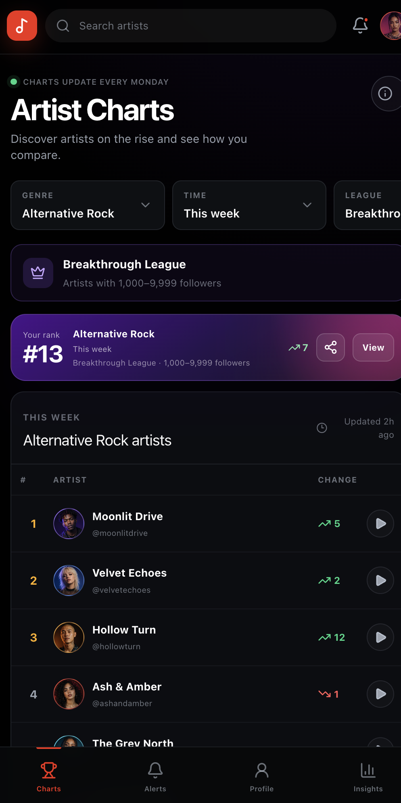
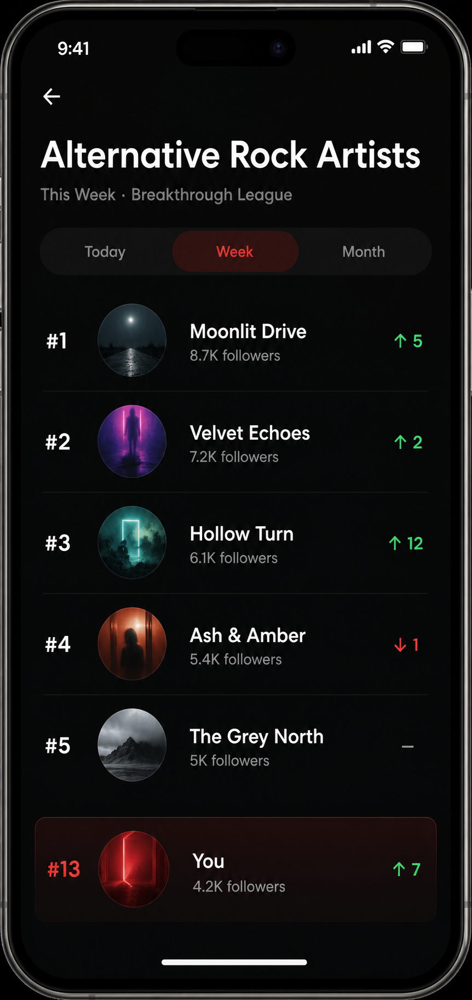
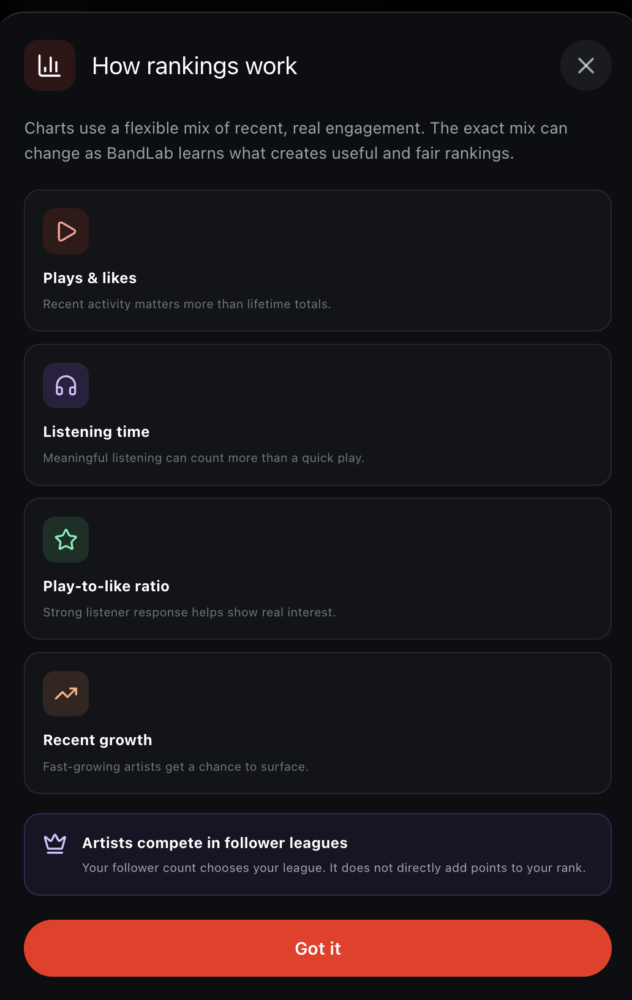
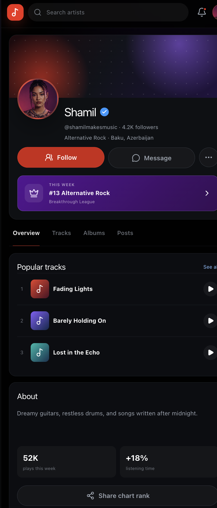
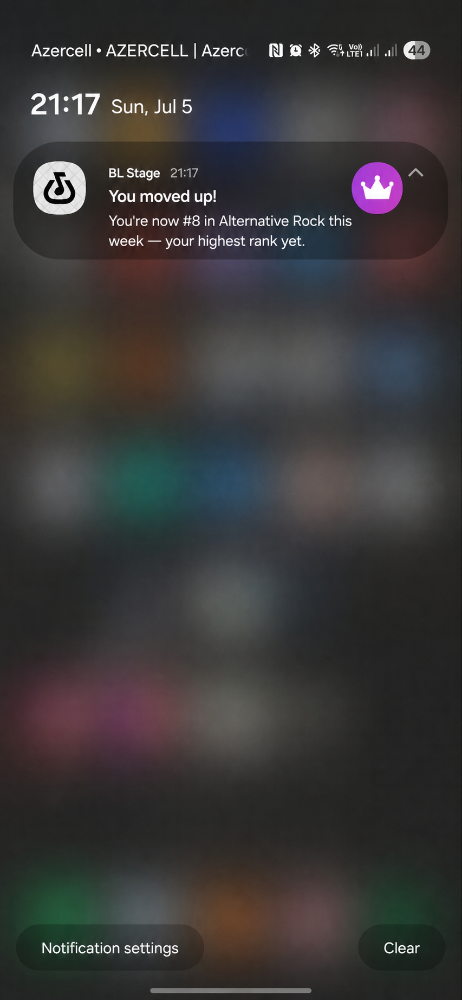
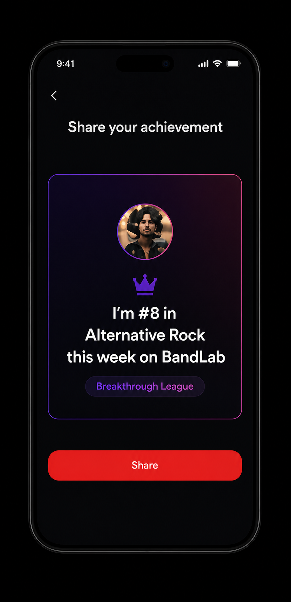
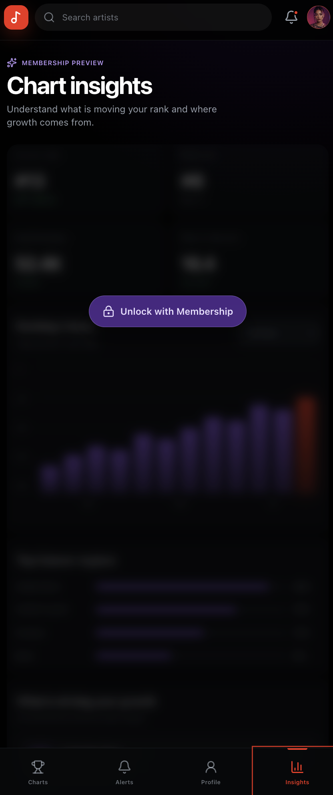

# Artist Charts

## Can this be a standalone feature?

🟢 Yes.

## UI and reference

## The idea

Inspired by this [BandLab feature wishlist](https://www.reddit.com/r/Bandlab/comments/1qo2i10/my_bandlab_2026_feature_wishlist_an_indepth_guide/).

Artist Charts rank popular and fast-growing artists on BandLab.

Artists are added automatically. They do not need to apply, and listeners do not vote.

The goal is to:

- Help listeners discover artists
- Give creators more recognition
- Make artist growth easier to see
- Give creators a reason to keep publishing and return to BandLab

## Why it matters

Many creators publish music without knowing whether they are making meaningful progress. Plays, likes, and follower counts move slowly and do not show how an artist compares with similar creators. Discovery can also favor artists who already have large audiences.

Artist Charts could:

- Turn recent progress into a clear and achievable goal
- Give creators recognition through ranks, movement, badges, and personal bests
- Help listeners discover smaller and growing artists
- Give artists reasons to return for chart updates and milestones
- Encourage more publishing, promotion, and sharing outside BandLab

The charts need to update often enough to feel alive. They should reward recent, real engagement and give artists in every league a realistic chance to appear.

## Charts

People can explore artist rankings using three filters:

- **Timeline** — Today, This Week, or This Month
- **Genre** — Hip-Hop, Rock, Pop, Electronic, R&B, Alternative Rock, and other major genres
- **League** — artists grouped by follower count

## How ranking works

Rankings can use a flexible mix of signals, such as:

- Plays and likes
- Listening time
- Play-to-like ratio
- Recent growth in plays, likes, and other engagement

## Artist leagues

A single global chart would probably be dominated by artists who already have large audiences. To give smaller artists a fairer chance, artists compete in leagues based on follower count:

- **Starter League** — Under 100 followers
- **Emerging League** — 100–999 followers
- **Breakthrough League** — 1,000–9,999 followers
- **Established League** — 10,000–99,999 followers
- **Headliner League** — 100,000+ followers

BandLab places artists into the right league automatically. Artists should not choose or change their league manually.

For example, an artist with 500 followers competes with artists at a similar level, not with an artist who has 500,000 followers.

This gives more artists a realistic goal and helps listeners discover emerging creators at different stages of growth.

## Profile badge

Ranked artists can have a badge on their profile, for example:

> #8 Alternative Rock Artist This Week 
> Breakthrough League · Updated 2 hours ago

The badge makes chart success visible on the artist’s profile. Showing when it was updated tells visitors that the rank is current. Tapping the badge opens the related chart.

## Notifications

BandLab can notify artists about meaningful chart moments:

- You entered the Top 100 Hip-Hop Artists this week.
- You moved up from #24 to #12 this week.
- You moved down from #12 to #18 this week.
- The charts have been updated. Check your new rank.

Artists may not check every chart update on their own. Notifications bring them back for meaningful moments and can encourage them to publish, promote their music, and engage with listeners. They should focus on milestones so they feel rewarding rather than noisy.

## Sharing

Artists can share their rank outside BandLab, for example:

> I’m the #8 Alternative Rock Artist this week on BandLab.

A ranking gives artists something specific to celebrate. Sharing can bring outside listeners to the artist’s profile and create organic promotion for BandLab.

## Premium chart insights

The main chart experience should remain free. Members could get deeper insights, such as:

- Detailed ranking history over weeks or months
- Listener demographics and regions
- Comparisons with other artists in the same league
- Longer-term performance trends, such as a 90-day view

This adds membership value without hiding the core ranking, recognition, or discovery experience behind a paywall.

