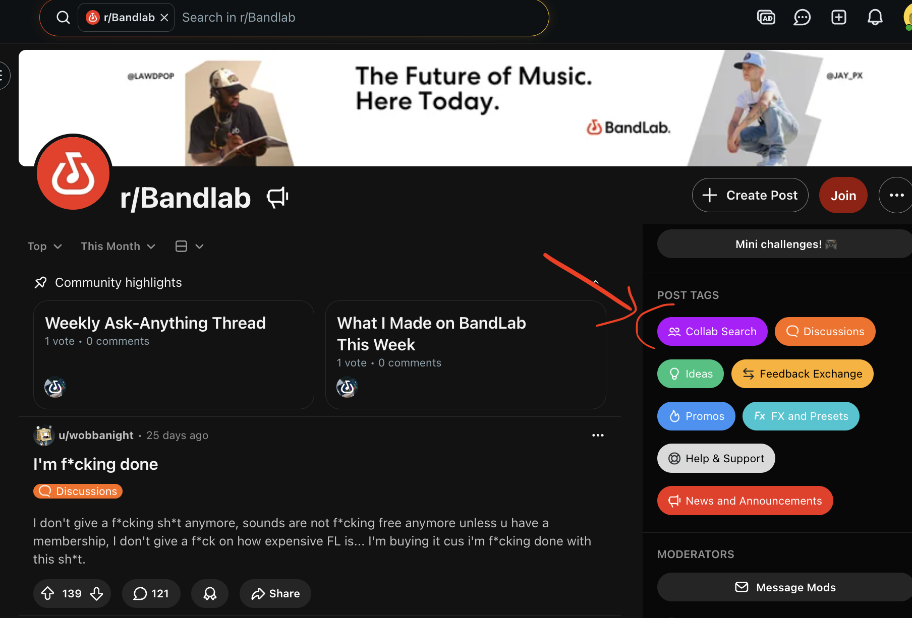
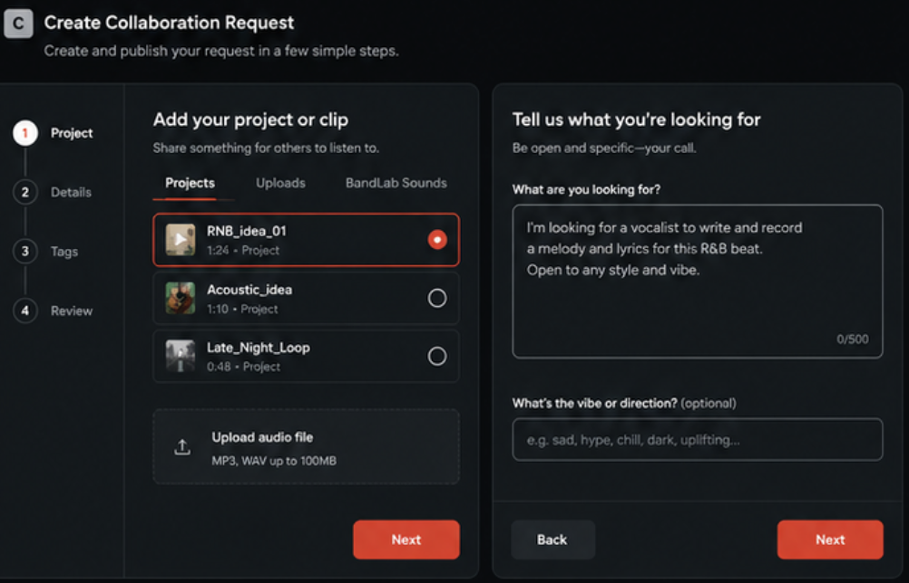
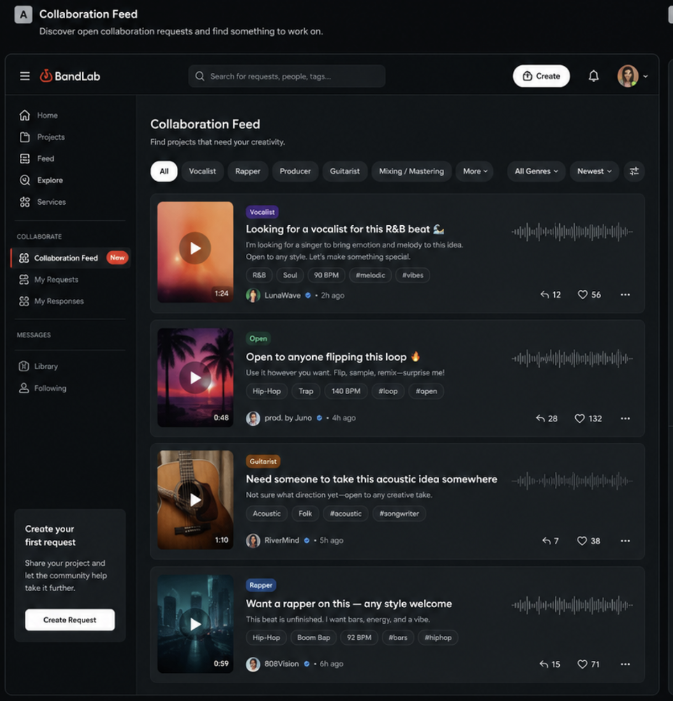
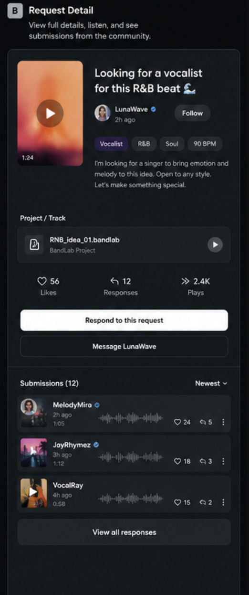
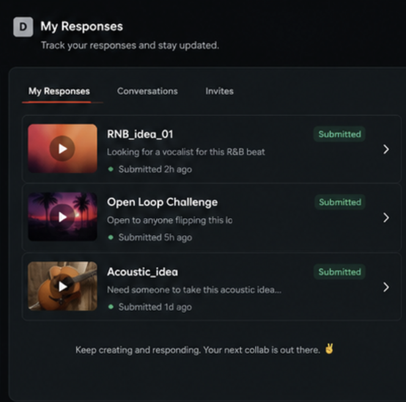

## Can this feature be a separate/standalone MVP?

Yes

## Implementation efforts

Medium

# Feature idea: Open Collaboration Requests

## Problem

Artists often need help with their tracks but have no structured way to ask for it.

On ressit there is 'Collab Search' tag in Bandlab subreddit; artists posting "who wants to collab?" or "need help finishing this"

BandLab has no dedicated place where artists can find collaborators based on a specific project. 
There is no way to say "here is my project, this is what I need" and have the right people discover it.

## Idea

Let artists share their project and describe what they are looking for in an open, flexible request.

The request can be anything:

- Looking for a vocalist
- Need someone to produce this idea
- Want a rapper on this beat
- Open to anyone remixing this
- Just looking for a collaborator to take this somewhere

The artist is not forced to define a specific part or section. They describe their need in their own words, and others respond however makes sense.

## How it works

The artist creates a collaboration request from their project or track.

They provide:

- A link to their project or clip¡¡
- A short description of what they are looking for
- Optional tags: role needed (vocalist, producer, rapper, etc.), genre

The request is published as a card and appears in a collaboration feed.

## Collaboration feed

BandLab could have a dedicated feed for active collaboration requests.

Users open this feed with intent — they want to contribute or find creative opportunities.

They can browse and filter by:

- What is needed: vocalist, rapper, producer, guitarist, mixing, etc.
- Genre: Hip-Hop, R&B, Rock, Pop, Electronic, etc.
- Activity: newest, most responses

Example cards:

> "Looking for a vocalist for this R&B beat"
> "Open to anyone flipping this loop"
> "Need someone to take this acoustic idea somewhere"
> "Want a rapper on this — any style welcome"

## Responding

Other users can respond to a request in multiple ways:

- Submit their own version or remix
- Record and attach a new part
- Simply reach out and start a conversation
- Ask to be added as a collaborator on the project

There is no single forced response flow. The artist decides what to do with each response.

## Submissions are public

TBD: Users might submit their update versions of the project so that artist can review.

Submissions are visible to everyone.

This gives responders exposure even if they are not accepted, and lets the community discover new talent through these contributions.

Other users can listen, like, comment, or follow the person who responded.

## Why users would respond

Responders get:

- Exposure and portfolio material
- A chance to connect with other artists
- A path to becoming an official collaborator

This is also useful for users who want to create but do not know where to start. 

An open request gives them something to respond to without starting from zero.

## Monetizations
TBD