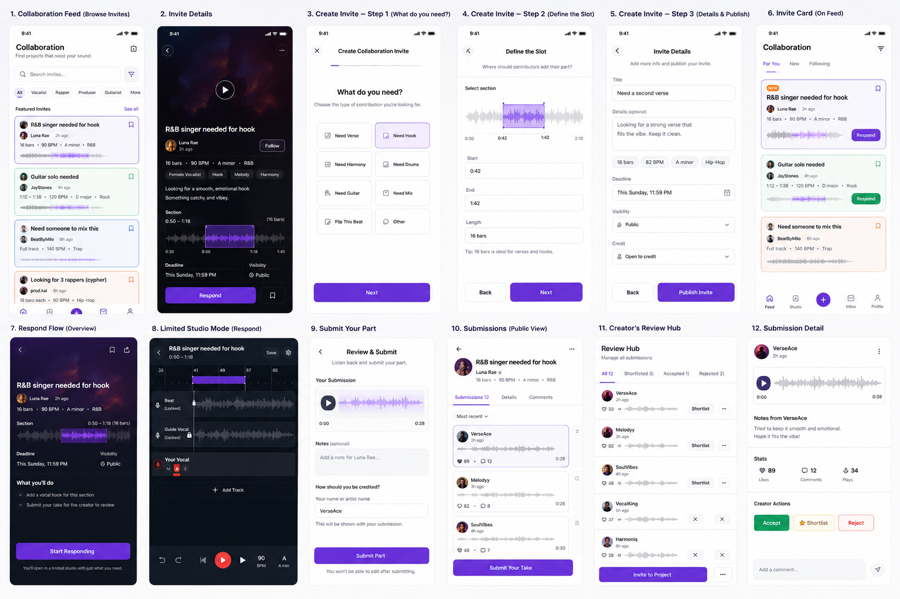

## Can this feature be a separate/standalone MVP?

Not sure

## Implementation efforts

Can be quite complex

## Inspired by

'Collab Search' tag in Bandlab subreddit, this tag is often used by users to searh for collaborators

## UI drafts

# Feature idea: Open Collaboration Invites

## Problem

Artists often  need help with one specific part of a track.

The're many posts like this:

https://www.reddit.com/r/Bandlab/comments/1okk624/just_made_this_song_having_trouble_finishing_the/

Examples:

- "I need someone to finish the verse."
- "I need a female vocalist for the chorus."
- "I need someone to mix this."
- "Looking for a guitar solo from 1:42 to 2:05."
- "I have a beat, but I need rappers on it."

Today this often becomes a generic “who wants to collab?” post or a full project fork.
But many creators do not want someone to touch the whole project. 
They just need one clear contribution.

## Idea

Let creators publish a structured collaboration invite from a project or clip.

Instead of saying “collab?”, the creator clearly says what is missing.

Examples:

- Open Verse
- Need Drums
- Need Guitar
- Need Mix
- Flip This Beat

The request is specific, so other users immediately understand what they can add.

## How it works

The creator creates an invite and defines the slot.

Example:

Need: second verse
Section: after 0:42
Deadline: Sunday

The invite appears as a special card

There can be a feed of such invites where user can also filter by certain criterias like genres/skills/talents

## Responding flow

When a user taps Respond, BandLab opens Studio in a limited response mode.

They record their part and submit it.

They do not need full access to the original project.

## Submission should be public

Submissions should be public.

This gives responders exposure even if they are not accepted.

Other users can listen, like, comment, follow the responder, or vote on responses.

## Submission review

The original creator gets all submissions in one place and can:

Listen
Shortlist
Comment
Reject
Accept
Invite to project
Create a collab version
Credit the responder

## Collaboration feed / board

BandLab could have a separate feed or board for active collaboration requests.

This would be a place where users go specifically to find opportunities to join.

Users could browse or filter requests by:

- What is needed: vocalist, rapper, guitarist, drummer, producer, mixing help
- Genre: Hip-Hop, R&B, Rock, Pop, Electronic, etc.
- Deadline

Example cards:

“R&B singer needed for hook”
“Guitar solo needed from 1:12–1:38”
“Need someone to mix this track”
“Looking for three rappers for a cypher”
“Flip this beat”

This is different from the normal feed because users open it with intent: they want to contribute.

## Why users would respond

Responders get:

- Exposure
- A clear creative prompt
- Portfolio material
- A chance to get noticed
- A chance to become an official collaborator

* This is useful because many users want to create, but they do not always know what to make.

A clear invite gives them a task:

“Add 16 bars to this beat.”
“Sing harmony on this hook.”
“Flip this loop.”
“Add drums to this acoustic idea.”