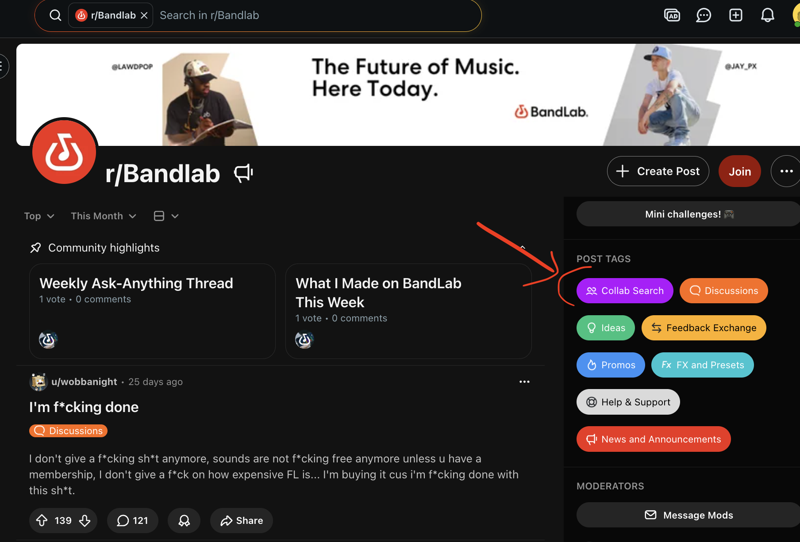
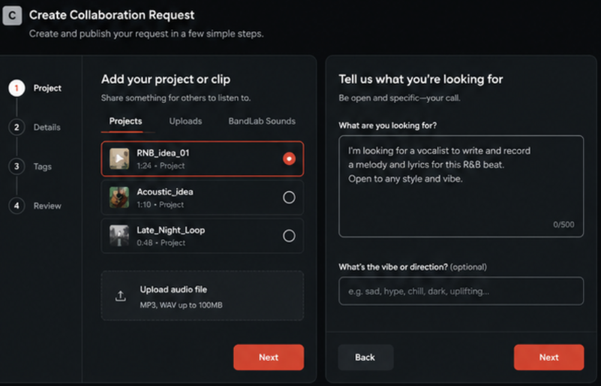
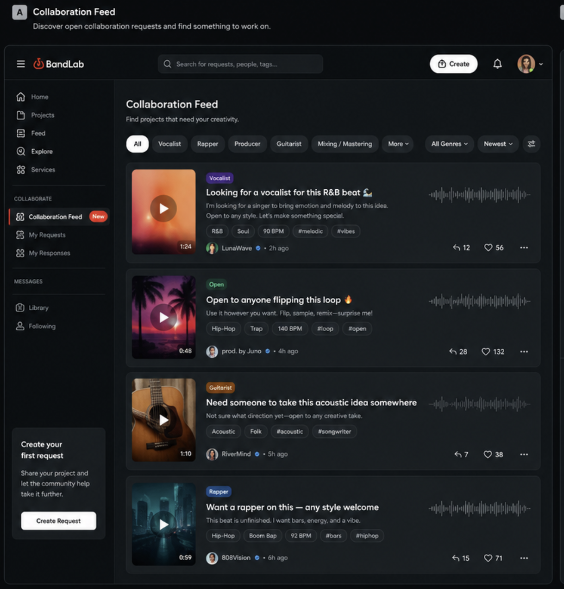
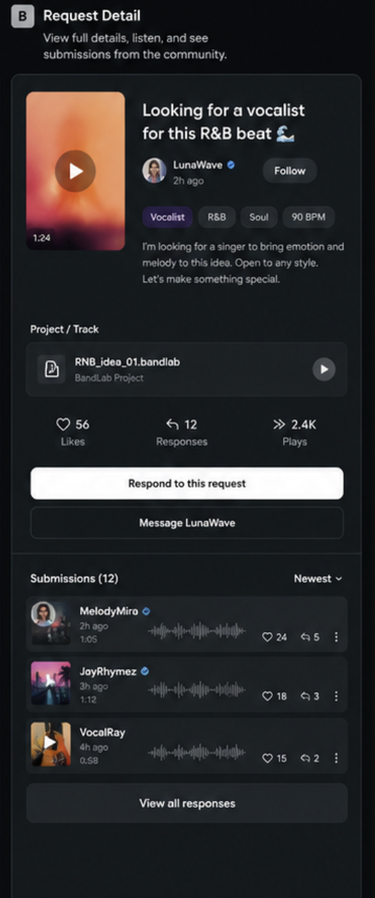
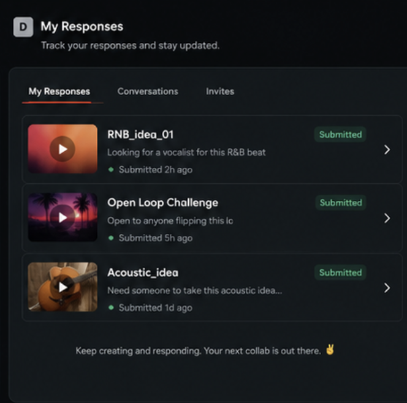

# Open Collaboration Requests

## Can this be a standalone feature?

🟢 Yes.

**Estimated effort:** Medium

## UI and reference

The BandLab subreddit already uses a “Collab Search” tag for posts such as “Who wants to collaborate?” and “I need help finishing this.”

## The idea

Let artists publish an open request when they want help with a project. They might need a vocalist, rapper, producer, remix, or simply someone to take an unfinished idea further.

The request stays flexible. Artists explain what they need in their own words instead of following one fixed collaboration format.

## What problem does it solve?

Artists often need help with a real track but have no structured way to explain what they need and reach the right people. General “Who wants to collab?” posts lack project context and are quickly lost in busy feeds.

At the same time, people who want to contribute have no easy place to find active projects that match their skills, genre, or interests.

## Creating a request

An artist starts from a project or track and adds:

- A project, track, clip, or uploaded audio file
- A short description of what they want
- Optional tags such as role, genre, mood, or style

The request is published as a card in a dedicated Collaboration Feed.

## Collaboration Feed

People open this feed because they want to contribute or find something to work on. They can filter by role, genre, tags, newest, or most active.

Each card lets them preview the audio and understand the request before opening it.

## Responding

People can respond in whatever way fits the request:

- Submit a version, remix, or new part
- Attach a recording
- Send the artist a message
- Ask to join the project as a collaborator

The original artist reviews the responses and decides what happens next.

Users can also keep track of their requests, responses, conversations, and invites.

## Public submissions

Responses could be public so other people can listen, like, comment, and discover the person who responded. This gives contributors some exposure even when their version is not selected.

This is still an open choice: some requests may work better with private responses, or the artist may need control over whether submissions are public.

## Why users would take part

Request owners get relevant help around a real project. Responders get a clear starting point, exposure, portfolio material, new connections, and a path to becoming an official collaborator.

This is especially useful for people who want to create without starting from an empty project.

## Why it could help retention

Owners return to check submissions and continue conversations. Responders return to follow their work and see whether they were invited. Successful matches create a longer loop as both artists keep working on the project inside BandLab.

## Where the biggest impact could be

- More successful collaborations around real projects
- More unfinished ideas turning into completed tracks
- Better discovery of creators by role, genre, and skill
- More messaging, project activity, and repeat visits
- More exposure for people who respond publicly

## Monetization ideas

- Let artists boost a request so it appears more often to a relevant audience.
- Let artists choose the roles, genres, or audience they want the boost to reach.
- Limit how many active requests free users can have, for example one at a time.
