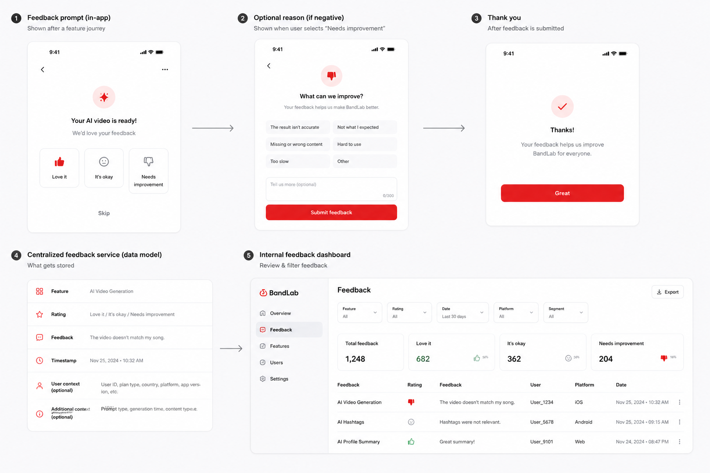

# In-App Feature Feedback

## Can this be a standalone feature?

🔴 No. It should be a shared platform capability that any feature can use.

## Draft UI

## The idea

Occasionally ask users for quick feedback after they use a feature:

- 👍 Love it
- 😐 It’s okay
- 👎 Needs improvement

If they choose a negative rating, they can select a reason and optionally add a short comment.

## What problem does it solve?

Analytics show what users did, but not always how they felt about it.

For example, analytics may show that an AI video was generated successfully. They do not show whether the video matched the song or whether the user found it useful.

This matters most for experimental and AI-powered features, where the experience may work technically but still produce a disappointing result.

## When it appears

The prompt can appear after an AI video, profile summary, hashtag generation, new onboarding flow, or another experimental feature.

Feedback should always be quick, optional, and shown occasionally rather than after every use.

## Feedback flow

1. The feature finishes.
2. BandLab asks for a simple rating.
3. A negative rating can open quick reasons such as inaccurate result, unexpected content, hard to use, or too slow.
4. The user can add an optional comment.
5. BandLab confirms that the feedback was received.

## Shared feedback service

Instead of building a separate system for every feature, all features can send feedback to one service.

Each entry could include:

- Feature name
- Rating
- Optional reason and written feedback
- Timestamp
- Platform and app version
- Useful user or feature context, where appropriate

An internal feedback page can show totals and let teams filter by feature, rating, date, user segment, and platform. Teams could also export results for deeper analysis.

## Why it matters to BandLab

Combining feedback with analytics shows perceived quality, usefulness, common frustrations, and problems that usage numbers alone cannot explain. This helps teams improve new features faster.

## Why it could help retention

The effect on retention is indirect but important. If teams can quickly spot disappointing, confusing, or low-quality experiences, they can improve them before those problems push users away.

For AI features, this also helps separate “the feature ran successfully” from “the user liked the result.”

## Where the biggest impact could be

- AI and experimental features where quality is subjective
- New flows that need fast feedback after launch
- Faster discovery of common user frustrations
- Better product decisions by combining sentiment with usage data

## First version

- Add the prompt to selected feature journeys.
- Support three rating options.
- Let users add an optional reason or comment.
- Store feedback in the shared service.
- Provide an internal page for viewing and filtering responses.
