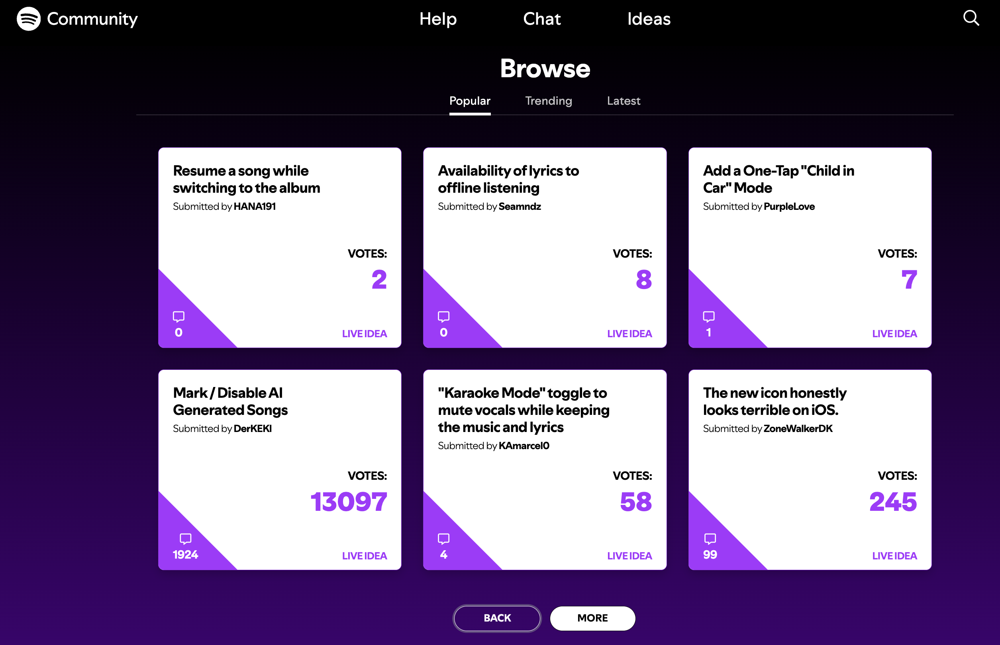

# Feature Requests

## Can this be a standalone feature?

🟢 Yes.

## UI and reference

Inspired by the [Spotify Community Ideas](https://community.spotify.com/t5/Ideas/ct-p/newideas) page.

## The idea

Give BandLab users one place to suggest improvements, vote for ideas, discuss them, and follow their progress.

## What problem does it solve?

Today, feature requests are spread across social media, support tickets, Reddit, comments, and direct messages. This makes it hard to see what users want most or how much demand an idea has.

Users also have no clear way to know whether BandLab has seen an idea or plans to act on it. A dedicated space brings those conversations together and makes the process easier to follow.

## Browsing requests

Users can filter requests by areas such as Studio, Collaboration, Discovery, Profile, Monetization, AI tools, Mobile app, or Community. They can sort by most voted, trending, or newest.

Each request shows its title, author, vote count, comment count, category, and current status.

## Submitting a request

A request includes:

- Title
- Description
- Category
- Optional screenshot or example

Before publishing, BandLab can suggest similar requests. This helps users support an existing idea instead of creating a duplicate.

## Voting and discussion

Users can vote for requests they want and comment with extra context. Votes show demand, while comments help explain the real problem and how people expect the feature to work.

Users can also follow a request and receive updates when its status changes.

Possible statuses:

- New
- Under review
- Planned
- Shipped

## Why it matters to BandLab

Analytics show what users already do. Feature Requests show what they wish they could do.

Votes reveal demand, while comments explain the need behind it. Together, they give product teams a structured signal that can support research and prioritization.

Votes should be treated as one product signal, not as an automatic promise that the most-voted idea will be built.

## Why it could help retention

This is more likely to improve trust and long-term engagement than daily retention. Users return to follow ideas, join discussions, and see status changes. Acknowledging feedback—even when an idea is not planned—can make people feel heard and more invested in BandLab.

## Where the biggest impact could be

- Clearer product demand and better research input
- Fewer requests scattered across support and social channels
- Better communication around planned and shipped work
- More trust and transparency between users and BandLab
