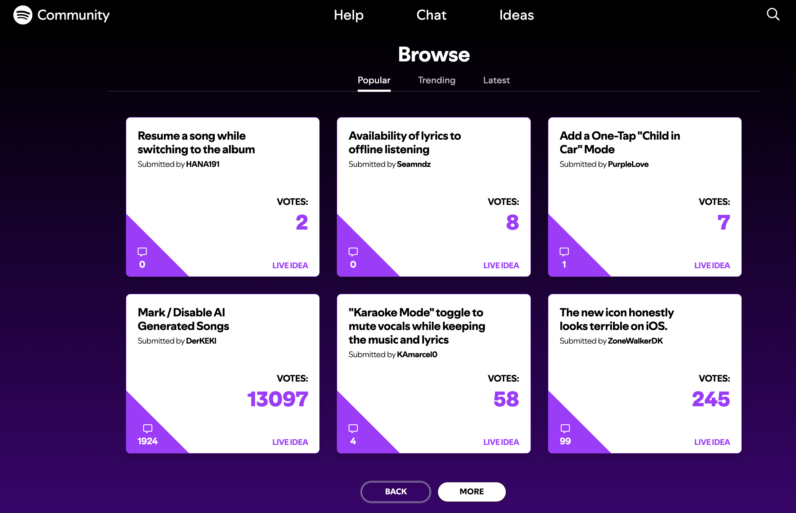

## Can this feature be a separate/standalone MVP?

Yes

## Refs

- https://community.spotify.com/t5/Ideas/ct-p/newideas

# Feature idea: Feature Requests

## Problem

BandLab users often have ideas about what should be improved, added, or changed, but this feedback is scattered across social media, support requests, Reddit, comments, and direct messages.

Because there is no dedicated place for feature requests, it is hard to understand what users want most and which ideas have real demand.

## Basic idea

Create a dedicated Feature Requests page where users can submit product ideas, vote for requests from others, and comment with extra context.

Users can:

- Share a feature request
- Vote for requests they want
- Comment on why it matters
- Follow request updates

## How it works

A user opens the Feature Requests page and browses existing requests.

They can filter by category, for example:

- Studio
- Collaboration
- Discovery
- Profile
- Monetization
- AI tools
- Mobile app
- Community

They can sort by:

- Most voted
- Newest
- Trending

## Submitting a request

A request includes:

- Title
- Description
- Category
- Optional screenshot or example

Before posting, BandLab can suggest similar requests to reduce duplicates.

## Voting

Other users vote for requests they want.

The vote count shows demand, while comments explain the actual user need behind the request.

Requests can also have simple statuses like:

- New
- Under review
- Planned
- Shipped

## Why users would participate

Users get a clear place to share ideas and feel that they can influence the product.

For example, a user can submit a request, see other people vote for it, and follow whether BandLab reviews or ships it.

## Why this is valuable for BandLab

This gives BandLab a structured signal for product demand.

Analytics show what users do. Feature Requests show what users wish they could do.

## Expected value

This could help with:

- Better understanding of user demand
- Better prioritization signals
- Fewer scattered feature requests
- More transparent product feedback
- More trust between users and BandLab