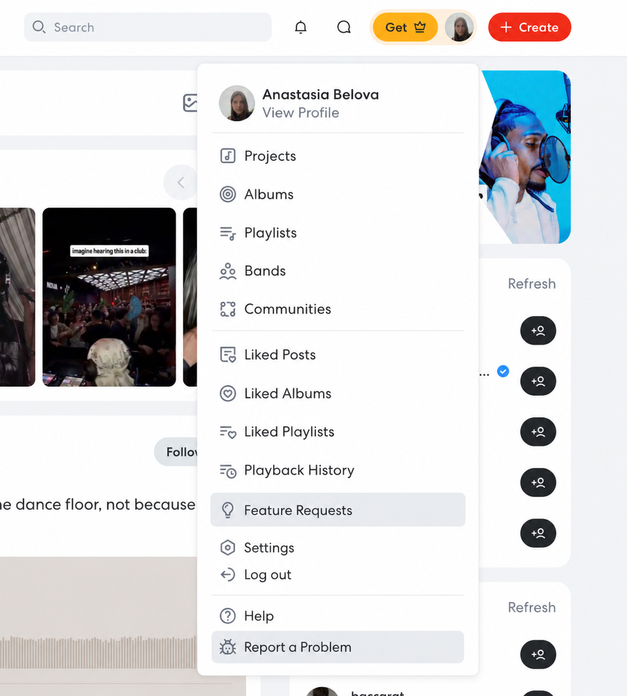
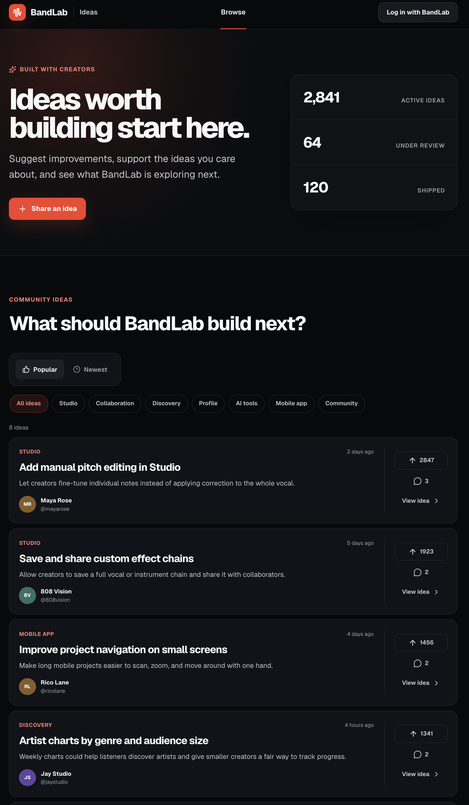
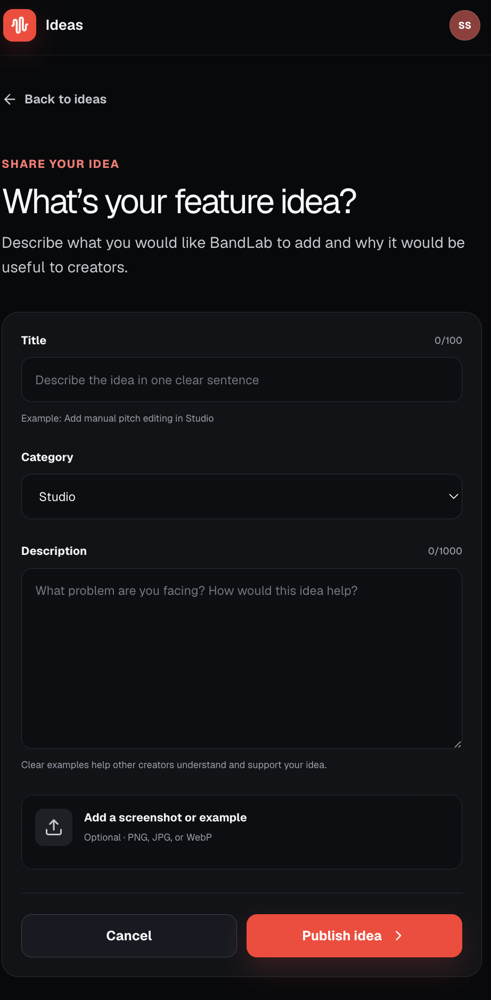
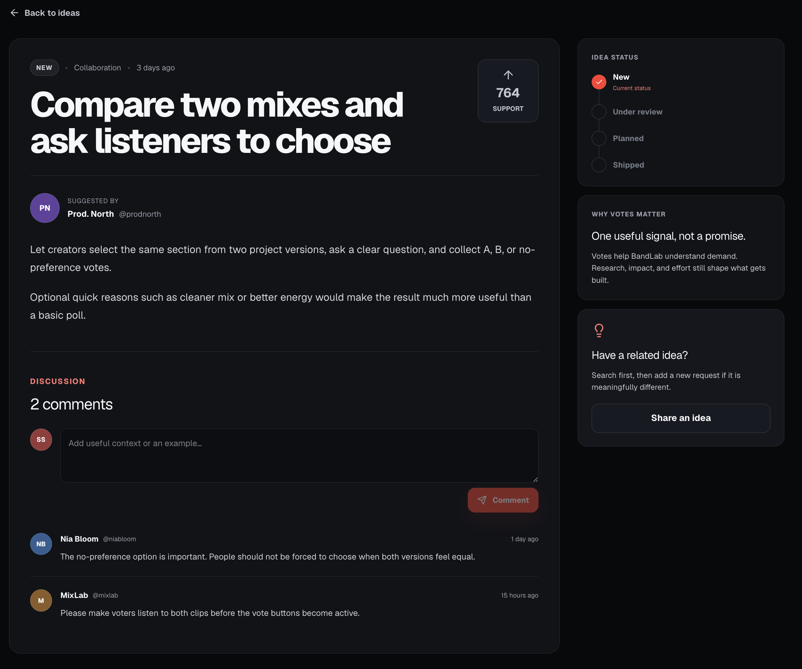

# Feature Requests

## UI and reference

Inspired by the [Spotify Community Ideas](https://community.spotify.com/t5/Ideas/ct-p/newideas) page.

<!--  -->

## The idea

> Check out [Bandlab Prototype](https://bandlab-ideas-prototype.sovshasovs.chatgpt.site/)

Give BandLab users one place to suggest ideas, improvements, vote for ideas, discuss them.

We can have new `Feature requests` option in this menu

By clicking on it ti can redirect to this page

## Why it matters

Feature requests are spread across social media, support tickets, Reddit, comments, and direct messages. This makes demand hard to measure, and users cannot easily tell whether BandLab has seen an idea.

A dedicated Feature Requests space could:

- Give product teams clearer demand and better research input
- Use comments to explain the need behind each vote
- Reduce requests scattered across support and social channels
- Give users one place to follow ideas and status changes
- Build trust through clearer communication about planned and shipped work

Votes should remain one product signal, not an automatic promise that the most-voted idea will be built.

## Browsing requests

Users can filter requests by areas such as Studio, Collaboration, Discovery, Profile, Monetization, AI tools, Mobile app, or Community. They can sort by most voted, trending, or newest.

Each request shows its title, author, vote count, comment count, category, and current status.

## Submitting a request

A request includes:

- Title
- Description
- Category
- Optional screenshot or example

## Voting and discussion

Users can vote for requests they want and comment with extra context. Votes show demand, while comments help explain the real problem and how people expect the feature to work.

Users can also follow a request and receive updates when its status changes.

Possible statuses:

- New
- Under review
- Planned
- Shipped

