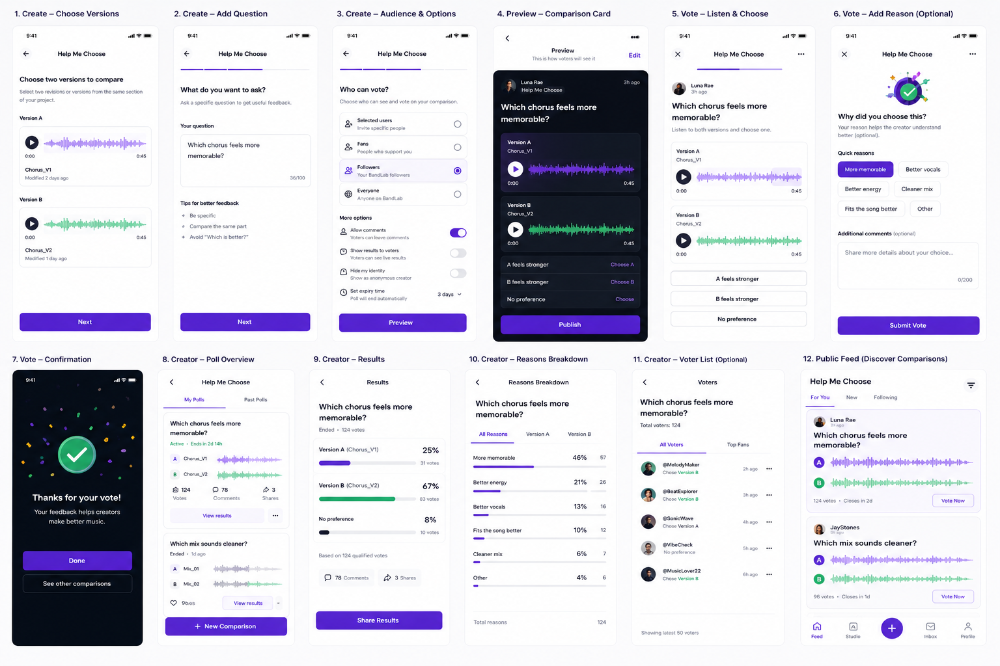
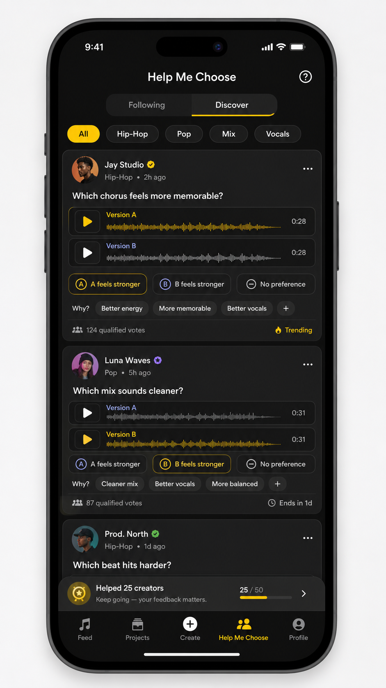

# Help Me Choose

## Can this be a standalone feature?

🟡 Probably.

## Draft UI

## The idea

Help Me Choose lets creators compare two versions of the same idea and ask people which one works better.

For example:

- Which chorus is more memorable?
- Which mix sounds cleaner?
- Which vocal take has better energy?
- Which version fits the song better?

## Why it matters

Creators often make difficult decisions alone, ask friends in chat, or use a general poll that is not designed for comparing music.

Help Me Choose could:

- Make creative decisions faster and more confident
- Turn scattered opinions into structured, useful feedback
- Create more listening and interaction between creators and listeners
- Bring creators back while votes arrive and when results are ready
- Give helpful voters progress, recognition, and reasons to take part again
- Create membership or paid-reach value for creators who want more responses

## Creating a request

A creator opens a saved project or revision and:

1. Selects two versions to compare.
2. Uses the same song section for both clips.
3. Writes a clear question.
4. Chooses who can vote.
5. Adds optional quick reasons voters can select.

Possible audiences include selected users, fans, followers, or everyone on BandLab.

The creator could also choose whether voting is anonymous, whether comments or results are public, and when the request ends.

## Publishing and discovery

A comparison appears as a simple card with:

- The creator’s question
- Version A and Version B
- Audio previews
- Voting options
- The number of qualified votes
- Time remaining

Requests could appear in the regular feed, on the creator’s profile, in a dedicated Help Me Choose feed, or as part of Feedback Exchange.

A dedicated feed could have Following and Discover sections, with filters for genre or feedback type such as mix, vocals, or songwriting.

## Voting

The voter listens to both versions and chooses:

- A feels stronger
- B feels stronger
- No preference

They can optionally select reasons such as “More memorable,” “Better vocals,” “Better energy,” or “Cleaner mix,” and add a short note.

This gives the creator more useful feedback than a simple A/B result.

## Results

The creator can see:

- The winning version
- Vote percentages and totals
- No-preference votes
- A breakdown of why people chose each version
- Optional comments
- A simple summary of the main takeaway

Results can also be shared.

## Voter recognition

Voting is quick, social, and gives listeners some influence over a creator’s decision. Small rewards can make it more engaging:

- “Helped 25 creators” badge
- Total and qualified votes
- Voting streaks
- Helpful Listener or genre-based badges
- A history of creators they helped

## Monetization ideas

Possible options:

- Make publishing comparison requests a member feature.
- Keep requests free for followers, but charge for wider discovery.
- Let creators pay to reach relevant genres, listeners, or creator groups.

The exact meaning of a wider or “global” audience still needs more thought.
