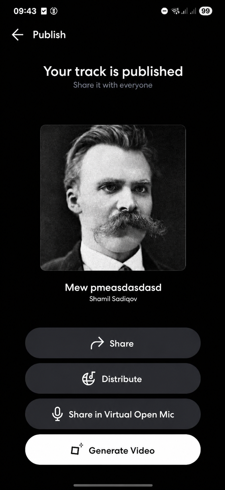

# Share a Published Track to Virtual Open Mic

## Can this be a standalone feature?

🔴 No. It should be part of the post-publish flow.

## Draft UI

## The idea

After a creator publishes a track, add a new action to the existing post-publish screen:

> Share in Virtual Open Mic

Creators already have tools for publishing music. What they often need next is an audience.

## How it works

1. The creator publishes a track.
2. BandLab shows the existing post-publish actions.
3. The creator taps “Share in Virtual Open Mic.”
4. The track appears in Virtual Open Mic.
5. Other users can listen, react, and comment.

This keeps the feature lightweight because it connects two existing experiences instead of creating a separate flow.

## Why it could work

Publishing can feel empty when a track gets no listens or reactions. Virtual Open Mic gives creators a better chance to reach people who are ready to discover new music.

The moment after publishing is also a natural time to suggest it: the creator has finished the track and is deciding what to do next.

This could lead to:

- More awareness of Virtual Open Mic
- More tracks shared there
- More listens, reactions, and comments
- A more rewarding publishing experience
- More creators returning to see what happened
