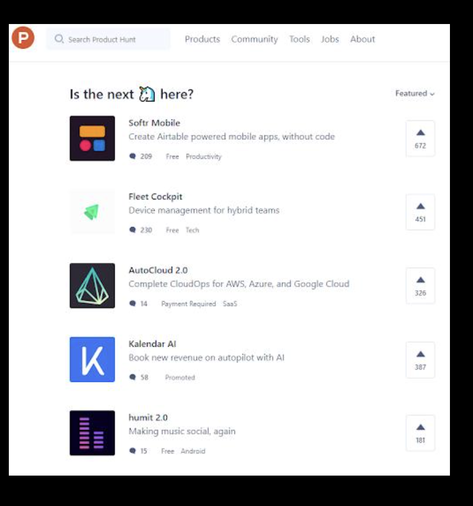
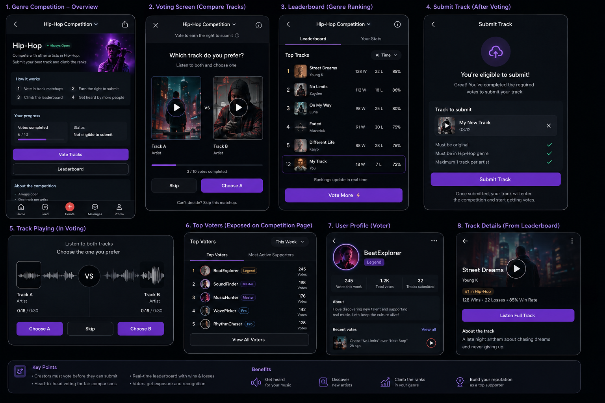
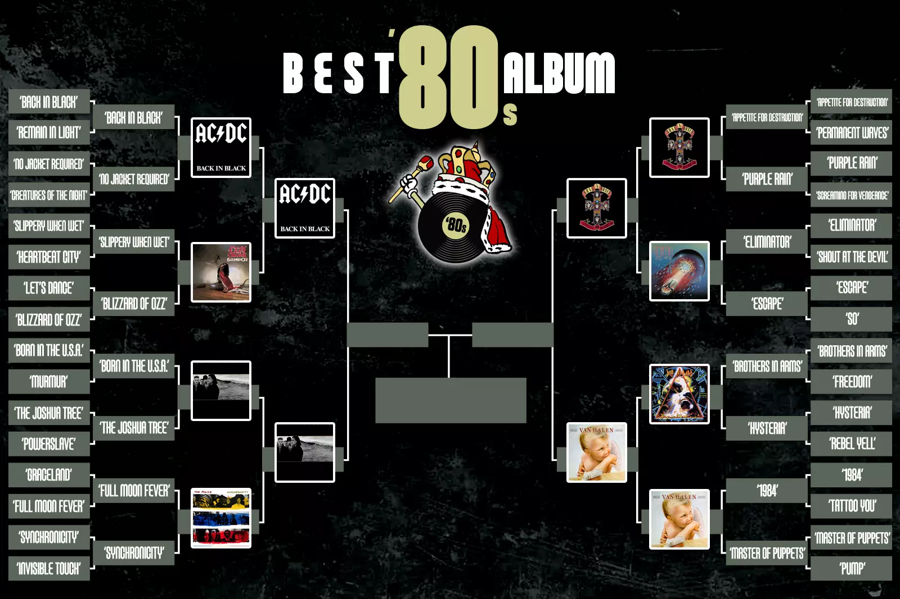

## Can this feature be a separate/standalone MVP?

🟢 Yes.

## Refs
* https://www.reddit.com/r/Bandlab/comments/1su0cac/weeekly_song_wars/
* https://www.reddit.com/r/Bandlab/comments/1ooo0u7/music_battle/
* https://www.reddit.com/r/Bandlab/comments/1tfa8xv/anybody_looking_for_song_wars_this_week_join_up/
* https://youtu.be/9NEsoIYq4kA

## Draft UIs

# Song battles

BandLab could have recurring track competitions for each genre, for example:

Hip-Hop, Rock, Pop, Electronic, R&B, etc.

Each competition runs for a limited time, for example 4–5 days, or maybe weekly.

Creators submit tracks into a genre competition. Other users vote between tracks from the same genre. At the end of the competition, the top tracks become finalists or winners.

The main idea is to give creators a fun and fair way to get their music heard.

## How it works

Before a creator can submit their own track, they first need to vote in a certain number of track comparisons.

For example, before submitting one track, the creator needs to vote 10 times.

In each vote, the user sees two tracks from the same genre. They listen to a short part of both tracks and choose which one they prefer.

After completing the required votes, the creator can submit one track to that genre competition.

This creates a fair exchange:
- If you want people to listen to your music, you also need to listen to and support other creators.

## Voting flow

The voting experience could be simple:

User opens the competition page.
User selects a genre, or enters the genre competition where they submitted.
User is shown two tracks from that genre.
User listens to a short part of both.
User picks the track they prefer.
The next comparison is shown.

This can support many tracks because every creator who wants to submit also helps generate votes for others.

## Fairness

To make voting more fair, some information could be hidden during voting:

- Artist name
- Follower count
- Play count
- Current ranking position

This way, users judge the music itself, not the popularity of the artist.

Each track should also be shown to a similar number of voters, so every creator gets a fair chance.

## Ranking

A track receives a win when it is chosen over another track.

A track receives a loss when the other track is chosen.

Tracks move up or down in the ranking based on voting results.

Example leaderboard item:

#12 — Track Name
18 wins · 7 losses · 72% win rate
↑ 5 positions

## Competition ending

The competition should not feel endless.

After the voting period ends, for example after 4–5 days, voting closes and the final results are shown.

The final page could show:

- Top tracks
- Finalists
- Winner
- Win rate
- Number of wins/losses
- Movement in ranking
- Badges or rewards

This makes the competition feel more exciting because there is a clear ending.

Users are not just voting forever. They are helping decide the final results.

## Seasons

Competitions could reset every week. This gives new tracks a chance to rise instead of letting old winners stay at the top forever.

Example:

- Hip-Hop Competition — Week 1
- Hip-Hop Competition — Week 2
- Rock Competition — June
- Electronic Competition — July

Each new season gives creators another reason to come back and submit again.

## Rewards

Highly ranked tracks could receive rewards or extra visibility.

Possible rewards:

- Badges
- Promotion
- Profile visibility
- AI tokens
- Prizes
- Other opportunities

For example:
- "Top 10 Hip-Hop Finalist" badge
- "Genre Winner" badge
- Featured placement on the competition page
- Extra exposure for the creator's profile or track

## Why users would vote

The main reason users would vote is that voting allows them to participate in the competition and submit their own music.

But voting should not only feel like a requirement.

It can also become another way for creators to participate in the community, discover music, and get noticed.

Voting helps users:

- Discover new music in their favourite genre
- Influence which tracks rise in the ranking
- Get noticed by other artists and listeners
- Bring more attention to their own profile and music
- Support other creators

## Active voters

The competition page could also show the most active voters.

This gives active voters some recognition and status.

It also gives users another reason to keep voting even after they have already submitted their own track.

For example:

- Top voters this week
- Most active voters in Hip-Hop
- Most active voters in Rock

This makes voting feel more valuable, not just something users do once before submitting.

## Comment section

We should also consider adding a comment section to the competition page.

This would let users discuss the competition, react to tracks, talk about finalists, and support other creators.

It can make the competition feel more alive and social.

## Why this could be valuable

This feature gives creators a clearer reason to participate.

They are not only posting music and hoping someone finds it. They are joining a visible competition where their track can move up, reach finalists, and possibly win.

It can also increase listening and voting activity because every submitted track creates more voting demand.

The feature could help with:

- More track discovery
- More creator engagement
- More repeat visits during each competition
- More profile and track visibility
- More community interaction
- More motivation for creators to publish music
