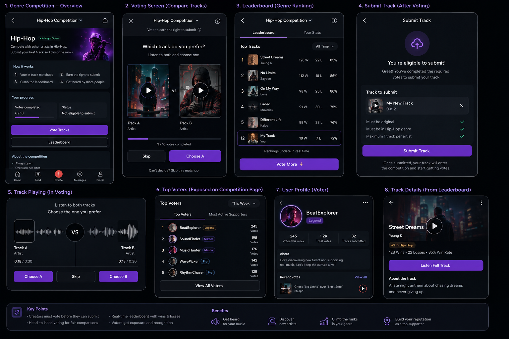
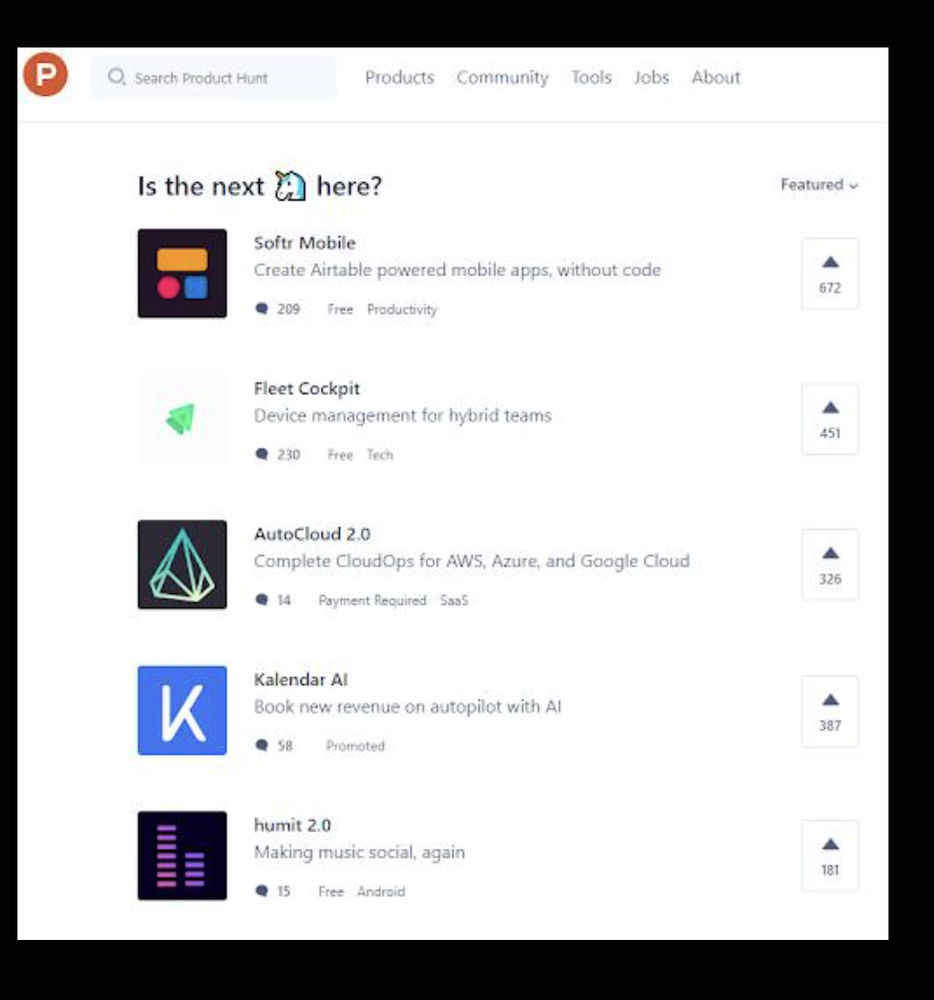
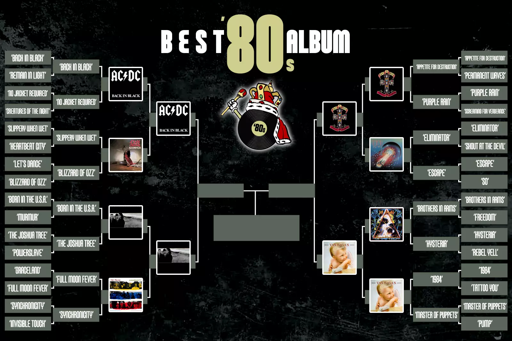

# Song Battles

## Can this be a standalone feature?

🟢 Yes.

## References

- [Weekly Song Wars](https://www.reddit.com/r/Bandlab/comments/1su0cac/weeekly_song_wars/)
- [Music Battle](https://www.reddit.com/r/Bandlab/comments/1ooo0u7/music_battle/)
- [Song Wars invitation](https://www.reddit.com/r/Bandlab/comments/1tfa8xv/anybody_looking_for_song_wars_this_week_join_up/)
- [Video reference](https://youtu.be/9NEsoIYq4kA)

## Draft UI

## The idea

Song Battles are short, recurring track competitions by genre, such as Hip-Hop, Rock, Pop, Electronic, and R&B.

Creators submit a track, listeners compare tracks from the same genre, and the best-performing tracks become finalists or winners. The goal is to make music discovery more fun while giving every participant a fair chance to be heard.

## Why it matters

Publishing a track does not guarantee that anyone will hear it. General feeds can favor established creators, while smaller artists get little feedback on how their music compares.

Song Battles could:

- Create more listening through the vote-to-submit exchange
- Give smaller artists a fairer chance to be heard
- Make music discovery more active and fun
- Bring users back to unlock submissions, follow rankings, see results, and join new rounds
- Increase visibility for tracks, profiles, voters, and finalists
- Encourage more publishing, promotion, and community interaction

## How it works

Before submitting a track, a creator must vote in a set number of battles. For example, ten votes unlock one submission.

Each vote shows two tracks from the same genre:

1. Listen to a short part of both tracks.
2. Choose the one you prefer, or skip if you cannot decide.
3. Continue until the required number of votes is complete.
4. Submit one track to that genre battle.

This creates a simple exchange: if you want people to hear your track, you also spend time listening to other creators.

## Fair voting

During a comparison, BandLab can hide:

- Artist name
- Follower count
- Play count
- Current rank

This keeps the focus on the music instead of the artist’s popularity.

Tracks should receive a similar number of comparisons. Voting and ranking also need protection against repeated, coordinated, or artificial votes.

## Ranking and results

A track gets a win when it is chosen and a loss when the other track is chosen. The leaderboard can show:

- Rank
- Wins and losses
- Win rate
- Movement in the ranking
- The creator’s own position

When a round ends, voting closes and the results show the top tracks, finalists, winner, and final stats.

## Rounds and seasons

Battles should have a clear ending. A round could run for one or two days, then reset so new tracks get another chance.

Examples:

- Hip-Hop Battle — one-day round
- Rock Battle — two-day round
- Electronic Battle — two-day round

Short rounds keep the competition active and give creators a reason to return.

## Rewards

Top tracks could receive:

- Finalist or winner badges
- Featured placement
- Extra track or profile visibility
- AI tokens
- Prizes or other opportunities

Examples include “Top 10 Hip-Hop Finalist” and “Genre Winner.”

## Voter recognition

Voting should be useful even after someone unlocks their submission.

The competition can recognize:

- Top voters in each round or genre
- Most active supporters
- Voting totals, streaks, or profile badges

This gives listeners status, helps them discover artists, and encourages continued participation.

## Community

A battle page could include comments where people discuss the round, react to finalists, and support creators.
