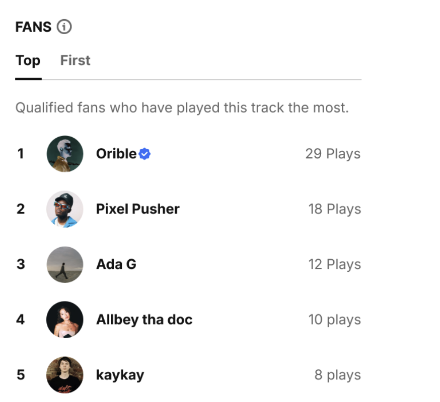

## Can this feature be a separate/standalone MVP?

No, should be part of the track page

# Feature idea: Track Fans

## Problem

Listening is mostly invisible.

A user can discover a track early, replay it many times, like it, and support the artist, but there is no public recognition for that.

For creators, play counts show numbers, but they do not clearly show who the real fans are.

## Basic idea

> Borrowed from SoundCdlou 'Top & First Fans' feature 

> https://help.soundcloud.com/hc/en-us/articles/33395290216859-Top-First-Fans

Add a public fan section on each track that recognizes the users who supported the track most.

Instead of multiple rankings, we can have one simple fan list.

This turns listening into visible status.

A listener can feel:

“I’m one of the top fans of this track.”

## How it works

On a track page, BandLab could show a fan leaderboard.

Example:

Top Fans
#1 @user
#2 @user
#3 @user
#4 @user
#5 @user

The ranking could be based on signals like:

- Plays
- Likes
- Early discovery
- Repeat listening
- Following the artist

To qualify, users may need to do useful actions such as:

- Play the track
- Like the track
- Follow the artist
- Have a profile picture

This makes the leaderboard more meaningful and encourages valuable platform actions.

## Why users would care

Users get public proof that they supported a track.

That gives them:

- Status
- Discovery credit
- Profile visibility
- A reason to listen again
- A reason to share their ranking

For example:

“I’m #3 fan of this track on BandLab.”

This can also make their own profile more discoverable.

## Why creators would care

Creators can see who their real fans are.

Not just anonymous play counts, but actual people who listen, replay, like, and support their music.

This can make creators feel that BandLab gives them a real fanbase, not just upload tools and vanity metrics.

## Expected value

This could improve:

- Creator retention
- Listening engagement
- Follow rate
- Like rate
- Profile completion
- Share rate
- Fan discovery from track pages

## Monetization

The public fan list should probably be free because it creates more social value and discovery.

A possible paid version could be deeper fan analytics for membership users.

For example:

- Free: public fan leaderboard on the track page
- Paid: full fan list, deeper fan insights, repeat listener trends, history

## Summary

Track Fans turns listening into recognition.

Listeners get status for supporting a track.

Creators get a clearer view of their real fans.

The feature can increase listening, likes, follows, profile discovery, sharing, and creator retention.
