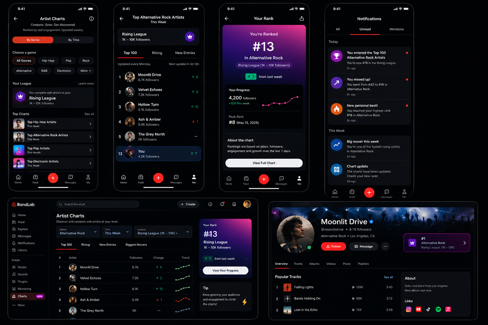

Mentioend heret => https://www.reddit.com/r/Bandlab/comments/1qo2i10/my_bandlab_2026_feature_wishlist_an_indepth_guide/

# Feature idea: Artist Charts

## Basic idea

Artist Charts are ranking pages that show the most popular and fastest-growing artists on BandLab.

Artists do not need to submit themselves. Users do not vote directly.

The ranking is calculated automatically based on artist performance on BandLab, mainly using plays and likes.

The goal is to help users discover artists, reward creators for growth, and give artists a clearer sense of progress.

## How it works

BandLab calculates artist rankings based on signals such as:

- Plays
- Likes
- Recent growth in plays and likes

Charts can be grouped by genre and time period.

Genres could include:

- Hip-Hop
- Rock
- Pop
- Electronic
- R&B
- Alternative Rock
- Other major genres

Time periods could include:

- Today
- This Week
- This Month

Examples:

- Top Hip-Hop Artists Today
- Top Rock Artists This Week
- Top Electronic Artists This Month
- Fastest Growing Pop Artists This Week
- Biggest Movers in Alternative Rock This Month

This means users do not only see one global artist chart. They can explore charts based on genre and timeline.

## Artist tiers

One important part of this idea is artist tiers.

If we only create one global chart, already popular artists will probably dominate it.

To make the chart more fair and useful for smaller creators, artists can be grouped by audience size, for example based on follower count.

Example tiers:

- 0–100 followers
- 100–1,000 followers
- 1,000–10,000 followers
- 10,000–100,000 followers
- 100,000+ followers

This means artists are ranked against other artists at a similar level.

For example, a creator with 500 followers would not need to compete directly against a creator with 500,000 followers.

This makes rankings feel more achievable and helps surface emerging artists.

## Example charts

Some possible chart examples:

- Top Hip-Hop Artists Today
- Top Hip-Hop Artists This Week
- Top Hip-Hop Artists This Month
- Top Rock Artists in the 1K–10K Follower Tier
- Fastest Growing Electronic Artists This Week
- Biggest Movers in Alternative Rock This Month
- New Entries in Pop This Week

The focus should not only be lifetime popularity.

Charts should also reward recent activity, so new and growing artists have a chance to appear.

## Artist profile badge

If an artist appears in a chart, we can show a badge on their profile.

Example:

#8 Alternative Rock Artist This Week
#3 in the 1K–10K Follower Tier

Tapping the badge would open the related chart page.

This gives the artist recognition and also helps listeners discover similar artists in the same chart.

### Chart insights (🤑 Premium feature)

Artists could unlock deeper insights about their chart performance with a premium feature.

This could include:

- Detailed ranking history (how their position changed over weeks/months)
- Which demographics or regions are listening most
- Comparison with other artists in their tier

This gives artists a clearer understanding of their growth and what's driving their success, while creating a monetization opportunity for paid members.

## Ranking movement

Charts should show how an artist’s position changes over time.

Examples:

- ↑ Up 12 positions this week
- ↓ Down 3 positions
- New Entry
- Highest Rank: #5

This makes the chart feel alive and gives creators a reason to check their progress.

Artists could also see their ranking history and performance trends later, but this does not need to be part of the first version.

## Notifications

BandLab can notify artists when something meaningful happens in the chart.

Examples:

- You entered the Top 100 Hip-Hop Artists this week.
- Your ranking increased from #24 to #12.
- You are one of the fastest-growing artists in Alternative Rock this month.
- This is your highest chart position so far.

These notifications can create small moments of excitement and give creators a reason to open the app again.

## Sharing rankings

Artists should be able to share their ranking outside BandLab.

For example:

“I’m #8 Alternative Rock Artist this week on BandLab.”

This gives artists something to be proud of and can also bring organic promotion for BandLab.

## What problem does it solve?

Many creators publish music but get very little feedback about whether they are actually making progress.

Plays, likes, and follower counts can move slowly. A creator may not know whether their recent activity is helping.

Artist Charts turn that progress into something easier to understand.

For example:

“I’m currently #18 among Hip-Hop artists in my follower group this week.”

This solves two main problems.

First, it gives creators more recognition. Smaller artists can get a visible achievement even if they are not globally popular.

Second, it improves artist discovery. Listeners can find artists by genre, audience level, and recent performance instead of only seeing the biggest accounts.

It also gives creators a clearer goal. Moving from #42 to #25 can feel more motivating than simply gaining a few likes.

## Why it could help retention

The strongest potential impact is probably creator retention.

Artists would have reasons to come back and check:

- Their current position
- Whether they moved up or down
- Their highest position
- Who is ranked around them
- What they need to do to keep growing

Notifications make this stronger because they turn ranking changes into small wins.

Examples:

- You entered the Top 100 Hip-Hop Artists this week.
- You moved from #42 to #18 this week.

This can motivate creators to open BandLab, publish again, share their profile, and engage with their audience.

The ranking needs to change often enough to feel alive. If artists stay in the same position for weeks, they may stop checking it.

## Where the biggest impact could be

The biggest impact would probably be in three areas:

- Creator motivation and retention
- Discovery of smaller artists
- More publishing and promotion activity

The profile badge and shareable ranking are especially useful because they give creators something they may want to share outside BandLab.

Example:

“#8 Alternative Rock Artist this week on BandLab.”

## Monetization opportunities

This feature should probably not start with heavy monetization.

A safer future monetization option could be more detailed ranking history for members.

For example:

- Free users see current rank and recent movement.
- Members see abalytics like 90-day ranking history

This keeps the core chart experience available to everyone, while giving members extra insight.

## Risks / things to be careful about

The feature is strong, especially for creator retention, but only if rankings feel achievable for smaller artists.

Without follower-based groups, the feature could mostly reward artists who are already popular.

Then it may become just another generic chart, instead of something that helps more creators feel seen.

We should also make sure the ranking rewards recent plays and likes, not only lifetime popularity.