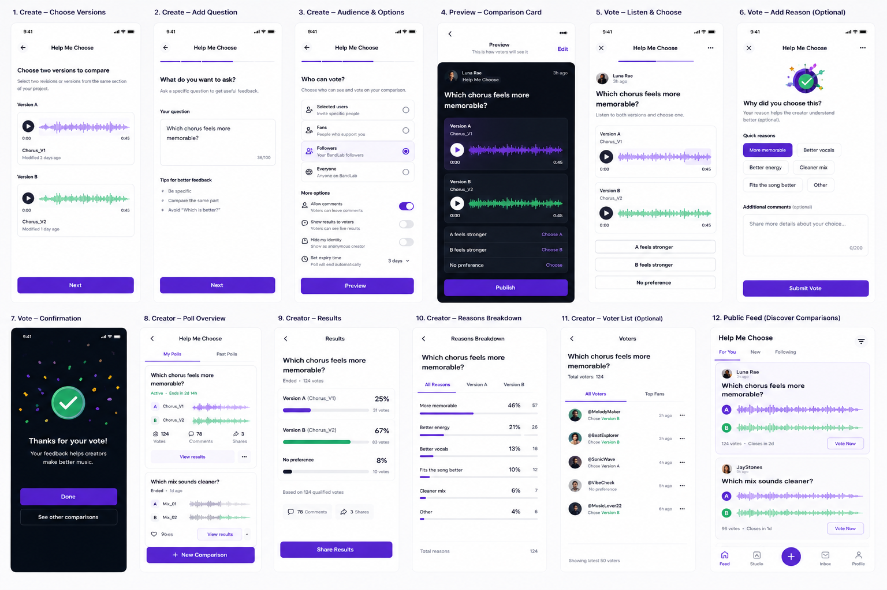

## Can this feature be a separate/standalone MVP?

Probably

## UI drafts

# Feature idea: Help Me Choose

## Basic idea

Help Me Choose is a feature that lets creators ask people to compare two versions of something and help them decide which one is better.

The simple problem is:

Creators often have multiple versions of the same idea and are not sure which one works better.

For example:

- Which chorus feels more memorable?
- Which mix sounds cleaner?
- Which vocal take has better energy?
- Which version fits the song better?

Right now, this kind of decision is usually private or manual. A creator might send versions to friends, ask in chat, or make a normal poll, but there is no focused comparison flow for music versions.

Instead of guessing alone, the creator can ask fans, followers, selected users, or the wider BandLab community to vote.

## How it works

The creator opens a saved project or revision and taps Help Me Choose.

They select two versions to compare.

For example:

Version A
Version B

Both clips should use the same section of the song, so the comparison feels fair.

Then the creator writes a specific question.

Example:

Which chorus feels more memorable?

After that, the creator chooses who can vote.

TBD where it should be published

- Feed ?
- Dedicate feed ?

Possible audiences:
- Followers
- Everyone ?

BandLab then creates a simple comparison card.

Example:

Which chorus feels more memorable?

Version A
▶ Listen

Version B
▶ Listen

A feels stronger
B feels stronger
No preference

## Voting experience

The voter listens to both versions and chooses one option.

After voting, they can optionally explain why they chose it using quick reasons.

Example reasons:

- More memorable
- Better vocals
- Better energy
- Cleaner mix
- Fits the song better
- Other

This makes feedback more useful than just “A won” or “B won”.

The creator can understand why people preferred one version.

## Result for the creator

The creator receives a clear result.

Example:

Version B — 67%
Version A — 25%
No preference — 8%

Based on 124 qualified votes

The result should be simple and easy to understand.

The creator should quickly see which version people preferred and why.

## Relationship to Crowd Review

BandLab already has or had Crowd Review described as a way to submit a finished or unfinished song to targeted listeners and receive ratings, comments, and a detailed report through ReverbNation.

But based on the notes, Crowd Review is disabled.

Help Me Choose would be simpler and more lightweight.

Instead of sending one track for a full review, the creator asks one specific comparison question about two versions.

## Monetization opportunities

This feature could be monetized in two ways.

One option is to make it a premium feature, where only membership users can publish collaboration requests.

Another option is to keep publishing free, but monetize the audience reach. When creating a request, the user could choose where it appears:

* **Followers** — free. The request appears on the user’s profile feed and is shown to their followers.
* **Global** — paid. The request appears on a dedicated collaboration board where any user can discover it, giving the request much higher exposure.

This needs more thinking, especially around what “global” should actually mean and who the larger audience should be: all users, users in a specific genre, nearby creators, active collaborators, or people with matching skills.

## Voter rewards

Maybe users who listen and vote could receive some kind of small reward.

This could encourage more people to participate and give feedback.

The reward does not need to be big. The main point is to make voting feel valuable.

## Risks / things to be careful about

The comparison should be fair.

Both versions should use the same part of the song, otherwise voters may choose based on the section rather than the version quality.